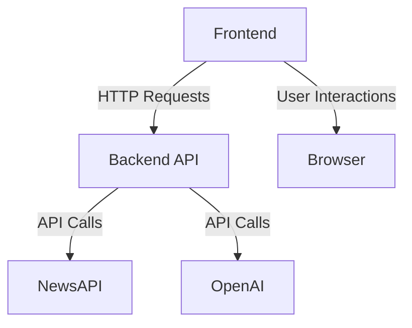

# ContentGPT - Comprehensive Documentation

## System Overview
ContentGPT is an AI-powered content generation platform that transforms news articles into video content packages. The system consists of:
- **Frontend**: Next.js application with React 19 and TypeScript
- **Backend**: FastAPI server with OpenAI integration
- **Database**: None (uses external NewsAPI service)

## Architecture Diagram


## Key Components

### Backend Services
1. **ContentService** (`content_service.py`)
   - Generates video ideas from news headlines
   - Creates complete content packages (scripts, graphics, thumbnails)
   - Supports multiple content styles (informative, humorous, dramatic, educational)
   - Uses OpenAI API for content generation

2. **NewsService** (`news_service.py`)
   - Fetches trending news from NewsAPI
   - Retrieves article content via web scraping
   - Supports multiple categories and countries

### Frontend Components
1. **Landing Page** (`page.tsx`)
   - Introduction to the platform
   - How-it-works section
   - Features overview

2. **Content Generator** (`content/page.tsx`)
   - Displays generated content packages
   - Tabbed interface for scripts/graphics/thumbnails
   - Copy and regenerate functionality

### API Endpoints
1. `GET /api/news/trending`
   - Parameters: category, country
   - Returns: List of trending news articles

2. `POST /api/content/video-ideas`
   - Parameters: headlines[], style
   - Returns: List of video ideas

3. `POST /api/content/generate-package`
   - Parameters: idea, platform, duration, style
   - Returns: Complete content package

## Data Flow
1. User selects news category and country
2. Frontend fetches trending news from backend
3. Backend retrieves news from NewsAPI
4. User selects headlines and video length
5. Frontend sends request to generate content package
6. Backend uses OpenAI to create package
7. Frontend displays generated content

## Configuration
### Environment Variables
- `OPENAI_API_KEY`: Required for content generation
- `NEWS_API_KEY`: Required for news fetching

## Error Handling
### Backend
- Logs errors to console
- Returns appropriate HTTP status codes
- Provides error details in response

### Frontend
- Displays error messages to users
- Allows content regeneration on failure
- Gracefully handles API failures

## Future Improvements
1. Add user authentication
2. Implement content saving/history
3. Add more customization options
4. Support additional platforms (YouTube, Instagram)
5. Add preview functionality for generated content

## Development Notes
### Backend Setup
```bash
cd backend
python -m venv venv
source venv/bin/activate
pip install -r requirements.txt
uvicorn app.main:app --reload
```

### Frontend Setup
```bash
cd frontend
npm install
npm run dev
```

## Testing
- Backend: Use FastAPI's built-in test client
- Frontend: Jest/React Testing Library
- Integration: Postman/curl for API testing
